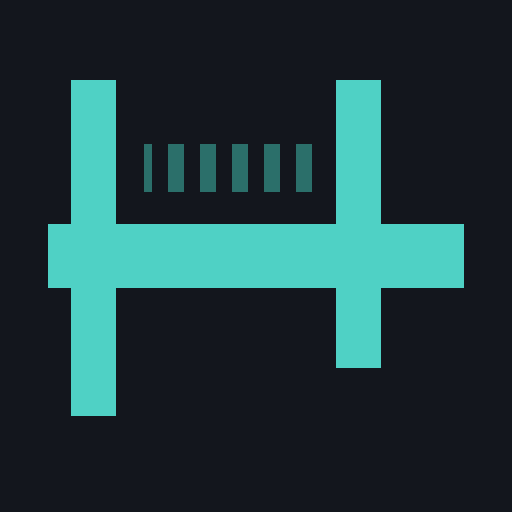
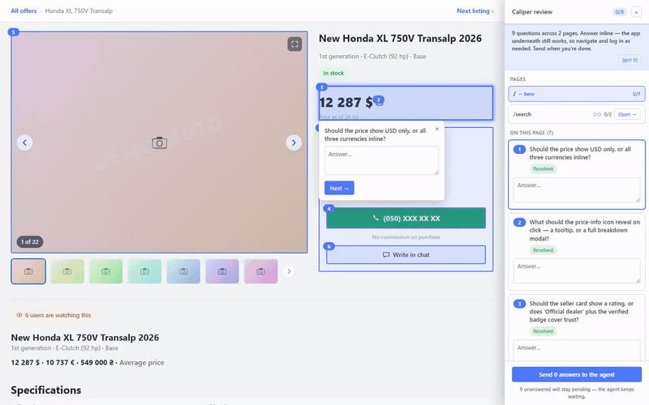

<p align="center">
  
</p>

<h1 align="center">Caliper</h1>

<p align="center">Design Mode &amp; UI annotation for AI coding agents — precise, element-pinned hand-offs between you and Claude Code / Cursor, in both directions.</p>

<p align="center">
  <a href="https://chromewebstore.google.com/detail/caliper/biedcnpfkefnocikeonknogjcippdopm"></a>
  <a href="https://chromewebstore.google.com/detail/caliper/biedcnpfkefnocikeonknogjcippdopm"></a>
  <a href="https://www.npmjs.com/package/@dendiem/caliper"></a>
  <a href="https://github.com/DenDiem/caliper/actions/workflows/ci.yml"></a>
  <a href="LICENSE"></a>
  <a href="https://discord.gg/gVgasNbNc"></a>
  <a href="https://t.me/dendiem"></a>
  <a href="https://www.linkedin.com/in/dendiem/"></a>
  <a href="https://donatello.to/dendiem"></a>
</p>

Caliper is built on one idea: a clicked DOM element already carries a **stable selector**, its
**owning component**, and **computed styles matched to your design tokens** — enough for an AI agent
to act on without decoding a screenshot. Two products put that to work in opposite directions.

## Two directions

### 🐞 Human → agent — **Caliper QA** ([`@caliper/qa-extension`](apps/qa-extension/README.md))

A Chrome extension for manual QA. A reviewer marks broken UI on the live app; the export is a compact
payload — selector, component, token-matched styles — an agent fixes straight from the file.

Some defects are not a moment but a sequence — "save works, but only the second time". For those,
**Start trace** records the reproduction: the steps taken, the DOM over time, console, network and
store actions, plus a ~1 MB video. The trace is what the agent reads; the video is for the human
reading the ticket.


### 💬 Agent → human — [`@dendiem/caliper`](apps/ask/README.md)

An MCP server for the reverse flow. While a coding agent implements a UI and is unsure what a region
should do, it asks *you* — questions pinned to the live elements, answered in place, sent straight
back as structured data.



## What's inside

Both products share the same element-picking core and in-page overlay:

| Package | Description |
| --- | --- |
| `packages/core` | Element → annotation logic. No `chrome.*`, no UI framework, portable to any shell. |
| `packages/overlay` | In-page picker UI rendered in a Shadow DOM. |
| `apps/qa-extension` | Chrome MV3 extension for manual QA — [README](apps/qa-extension/README.md). |
| `apps/ask` | MCP server for live agent→developer UI review — [README](apps/ask/README.md). |

## Quick start

Two independent tools — set up whichever direction you work in (or both).

### 🐞 Caliper QA — you mark, the agent fixes

[Install from the Chrome Web Store](https://chromewebstore.google.com/detail/caliper/biedcnpfkefnocikeonknogjcippdopm), or build it locally:

```bash
pnpm install
pnpm --filter @caliper/qa-extension build
```

Then load `apps/qa-extension/.output/chrome-mv3` via `chrome://extensions` → Load unpacked.

`pnpm --filter @caliper/qa-extension dev` gives you hot reload, but writes a development build to the
same directory: it registers the content script at runtime through the dev server instead of
declaring it in the manifest, so the picker stops working the moment that server is gone. If the
shortcut list shows `Alt+R — Reload the extension during development`, you are running the dev build.

Click the toolbar icon to open the side panel, mark an element, describe the defect, and save — then
review and export from the panel. **Start trace** in the same panel records a whole reproduction
instead of a single element; press **Stop** and the trace joins the session.

A developer reads either kind the same way — `caliper pull <ticket>` when QA filed it to Jira, or
`caliper read <zip>` when QA sent the archive directly.

### 💬 The MCP server — the agent asks, you answer

Register it with your coding agent (Claude Code, Codex, Cursor, any MCP client) — one command, and it
auto-updates on each launch:

```bash
npx @dendiem/caliper init
```

That installs the `caliper_ask` and `caliper_design` tools plus the `caliper-ask` / `caliper-fix`
skills. In Claude Code you can instead add it as a plugin: `/plugin marketplace add DenDiem/caliper`.
See [`apps/ask`](apps/ask/README.md) for the proxy/snippet modes, named targets, and the agent contract.

## Output

The extension turns each marked defect into a compact record — this is the JSON export (TOON and a
screenshot zip are available too):

```json
{
  "schemaVersion": 1,
  "annotations": [
    {
      "comment": "Padding is too small",
      "severity": "minor",
      "target": {
        "selector": "soa-inform-block p.info",
        "selectorConfidence": "medium",
        "componentName": "soa-inform-block",
        "componentSource": "tag-heuristic",
        "styles": {
          "padding-top": {"value": "4px", "token": "--spacing-1", "tokenMatch": "exact"},
          "color": {"value": "rgb(51, 51, 51)", "token": "--color-text-primary", "tokenMatch": "exact"}
        }
      }
    }
  ]
}
```

Screenshots live in a separate `assets` map keyed by `screenshotId`, and are omitted from
`Copy JSON` by default.

## Releasing the extension

Every tag matching `v*` builds, verifies, publishes to the Chrome Web Store and attaches the zip to
a GitHub release:

```bash
git tag v0.2.0
git push --follow-tags
```

The workflow takes the version from the tag name, so `package.json` is never bumped by hand.

**One-time setup.** The Chrome Web Store API can only *update* an existing item, so the first
version has to be uploaded manually — that upload is what mints the extension ID. After that:

1. Google Cloud Console → new project → enable **Chrome Web Store API** → OAuth client of type
   *Desktop app*.
2. Run `pnpm --filter @caliper/qa-extension exec wxt submit init` — it walks through the OAuth flow
   and prints the refresh token.
3. Add four repository secrets: `CHROME_EXTENSION_ID`, `CHROME_CLIENT_ID`, `CHROME_CLIENT_SECRET`,
   `CHROME_REFRESH_TOKEN`.
4. Verify without uploading anything: `wxt submit --dry-run --chrome-zip .output/caliper-<v>-chrome.zip`.

Each upload goes through Google's review, so a published tag is not live immediately.

## Privacy

Everything stays in `chrome.storage.local`. No backend, no network requests, no telemetry — see
[PRIVACY.md](PRIVACY.md).

## License

MIT
