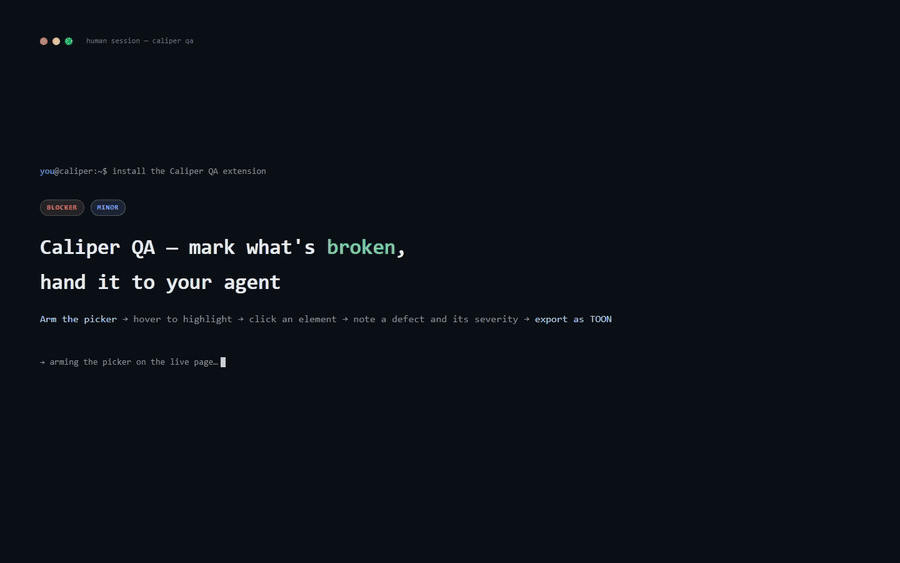

# @caliper/qa-extension

<p align="center">
  <a href="https://chromewebstore.google.com/detail/caliper/biedcnpfkefnocikeonknogjcippdopm"></a>
  <a href="https://chromewebstore.google.com/detail/caliper/biedcnpfkefnocikeonknogjcippdopm"></a>
  <a href="https://github.com/DenDiem/caliper/actions/workflows/ci.yml"></a>
  <a href="../../LICENSE"></a>
  <a href="https://discord.gg/gVgasNbNc"></a>
  <a href="https://t.me/dendiem"></a>
  <a href="https://www.linkedin.com/in/dendiem/"></a>
  <a href="https://donatello.to/dendiem"></a>
</p>

**Caliper QA** — the Chrome MV3 shell around `@caliper/core` and `@caliper/overlay`, built with [WXT](https://wxt.dev). A QA reviewer marks broken UI on the live app and exports it as a compact payload a coding agent fixes.



## Develop

```bash
pnpm --filter @caliper/qa-extension dev
```

Load `.output/chrome-mv3` via `chrome://extensions` → Developer mode → Load unpacked. `wxt build`
produces the same directory without the dev server.

## How the pieces talk

| Entry point | Responsibility |
| --- | --- |
| `entrypoints/content.ts` | Mounts the overlay, turns a draft into a `CaliperAnnotation`, sends it to the background. |
| `entrypoints/background.ts` | Toolbar click → open side panel and toggle the picker. Owns storage and screenshot capture. |
| `entrypoints/sidepanel/` | Session list, remove/clear, export. |
| `sinks/chrome-storage.sink.ts` | `AnnotationSink` over `chrome.storage.local`; screenshots go to `assets`, not into the annotation. |
| `screenshot/capture.ts` | `captureVisibleTab` cropped to the element with 16px padding via `OffscreenCanvas`. |

## Shortcuts

| Input | Action |
| --- | --- |
| Toolbar icon | Open or close the side panel |
| `Alt+Shift+C` | Switch the picker between **Mark** and **Browse** |
| `Alt+Shift+P` | Open the side panel |
| `Escape` | Dismiss the open popover |

Opening the panel mounts the picker in **Browse** — clicks pass through to the app, hold **Alt** to
mark. The footer toggle, or `Alt+Shift+C`, switches it to **Mark** — clicks mark, hold **Alt** to
reach the app. Closing the panel unmounts it.

Rebind the shortcuts at `chrome://extensions/shortcuts`. While active, the picker recomputes at most
once per animation frame, and only when the cursor crosses into a different element.

## Export

**Copy TOON** — the smallest payload for an agent: three tables (`session`, `annotations`,
`styles`) with explicit row counts, no braces or quotes.

**Copy JSON** — the same data as JSON, `assets` stripped.

**zip** — a single `caliper-<id>.zip`:

```
caliper-<id>/
  session.json     annotations with a relative `screenshot` path, no inline base64
  session.toon     the same session in TOON, ready to paste into an agent
  <id>.png         one cropped screenshot per annotation
```

The JSON points at the PNGs by path instead of carrying base64, so an agent reads the structure
cheaply and opens an image only when the structure was not enough.

## Send to Jira

Hand defects straight into a ticket instead of pasting text. One-time setup: open the extension's
**options** (right-click the toolbar icon → Options, or `chrome://extensions` → Details → Extension
options), enter your Jira **site**, **email** and an **API token** (create one at
id.atlassian.com → Security → API tokens), and press **Connect**. Credentials stay in
`chrome.storage.local` and are used to reach your Jira directly — no Caliper server is involved.

Then, from the side panel, press **Send to Jira**, pick the target issue (type a key or paste an
issue URL), choose whether to add the defects as a **comment** or the issue **description**, and
send. Each screenshot is uploaded as an attachment, and one structured comment lists every defect
(severity · component · `selector` · your note).

Screenshots land in the issue's **Attachments** panel — not inline in the comment body. Alongside
them a machine-readable `caliper-<id>.session.json` is attached, so an agent can reconstruct the whole
review offline with [`caliper pull`](../ask/README.md#fix-from-a-jira-ticket) — no running app needed.
