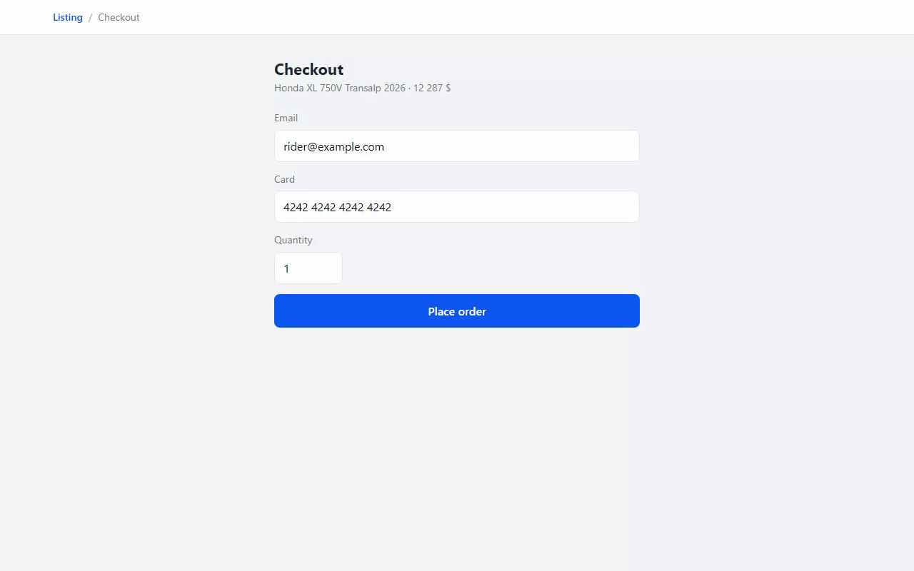

# @caliper/qa-extension

<p align="center">
  <a href="https://chromewebstore.google.com/detail/caliper/biedcnpfkefnocikeonknogjcippdopm"></a>
  <a href="https://chromewebstore.google.com/detail/caliper/biedcnpfkefnocikeonknogjcippdopm"></a>
  <a href="https://github.com/DenDiem/caliper/actions/workflows/ci.yml"></a>
  <a href="../../LICENSE"></a>
  <a href="https://discord.gg/gVgasNbNc"></a>
  <a href="https://t.me/dendiem"></a>
  <a href="https://www.linkedin.com/in/dendiem/"></a>
  <a href="https://donatello.to/dendiem"></a>
</p>

**Caliper QA** — the Chrome MV3 shell around `@caliper/core` and `@caliper/overlay`, built with [WXT](https://wxt.dev). A QA reviewer marks broken UI on the live app, or records a whole bug trace, and exports it as a compact payload a coding agent fixes.


## Develop

```bash
pnpm --filter @caliper/qa-extension dev
```

Load `.output/chrome-mv3` via `chrome://extensions` → Developer mode → Load unpacked. `wxt build`
produces the same directory without the dev server.

## How the pieces talk

| Entry point | Responsibility |
| --- | --- |
| `entrypoints/content.ts` | Mounts the overlay, turns a draft into a `CaliperAnnotation`, sends it to the background. |
| `entrypoints/collector.content.ts` | Main-world, `document_start`. Hosts rrweb, the Redux DevTools shim and the console/fetch patches. |
| `entrypoints/bridge.content.ts` | Isolated, `document_start`. Relays collector batches to the background and Start/Stop back. |
| `entrypoints/offscreen/` | `tabCapture` → `MediaRecorder`, VP9 under a fixed bitrate budget. |
| `entrypoints/background.ts` | Toolbar click → open side panel and toggle the picker. Owns storage, screenshot capture and the trace lifecycle. |
| `entrypoints/sidepanel/` | Session list, record bar, trace cards, remove/clear, export. |
| `trace/lifecycle.ts` | Start/Stop keyed by tab; merges the collectors and assembles the trace. |
| `trace/cdp.ts` | `chrome.debugger` network and console collector, with the fallback signal. |
| `trace/blob-store.ts` | IndexedDB for the video and replay — too large for `chrome.storage.local`. |
| `sinks/chrome-storage.sink.ts` | `AnnotationSink` over `chrome.storage.local`; screenshots go to `assets`, not into the annotation. |
| `screenshot/capture.ts` | `captureVisibleTab` cropped to the element with 16px padding via `OffscreenCanvas`. |

## Shortcuts

| Input | Action |
| --- | --- |
| Toolbar icon | Open or close the side panel |
| `Alt+Shift+C` | Switch the picker between **Mark** and **Browse** |
| `Alt+Shift+P` | Open the side panel |
| `Escape` | Dismiss the open popover |

Opening the panel mounts the picker in **Browse** — clicks pass through to the app, hold **Alt** to
mark. The footer toggle, or `Alt+Shift+C`, switches it to **Mark** — clicks mark, hold **Alt** to
reach the app. Closing the panel unmounts it.

Rebind the shortcuts at `chrome://extensions/shortcuts`. While active, the picker recomputes at most
once per animation frame, and only when the cursor crosses into a different element.

## Bug traces



Some defects are a sequence, not a moment. **Start trace** in the side panel records the reproduction
until you press **Stop**; the recording bar shows elapsed time and live counts of console errors and
failed requests, so you can tell the bug actually fired before you stop.

A finished trace holds four things:

| File | For | Contents |
| --- | --- | --- |
| `caliper-<id>.trace.json` | the agent | Steps, console, network (headers and bodies), store actions |
| `caliper-<id>.replay.ndjson.gz` | the agent | The rrweb DOM recording, for reconstructing the page at any instant |
| `caliper-<id>.webm` | the human | ~1 MB of video, VP9 at 12 fps |
| the session manifest | both | Metadata and a summary; it names the files rather than embedding them |

A trace belongs to the tab, not the page: navigating mid-recording appends a `navigation` step and
keeps going.

Two collectors run. `chrome.debugger` is preferred — it sees response bodies and uncaught-exception
stack traces — but it cannot attach while DevTools is open on the tab, which is common during QA. When
it cannot, the in-page `fetch`/`console` patches take over and the trace records
`network: fallback` so the agent knows bodies may be missing. Recording is never blocked by this.

Video has the same shape. `chrome.tabCapture` gives the better picture but needs the extension to have
been invoked on the tab from the toolbar, and Chrome revokes that grant on navigation — so when it is
unavailable the already-attached debugger session screencasts the tab instead, at half the rate. A
trace loses its video only when neither is possible, and the card says so when that happens.

Both collector modes are covered by `node scripts/trace-smoke.mjs` (debugger attached) and
`node scripts/trace-smoke.mjs --no-cdp` (in-page collectors only) — 15 and 14 assertions against a real
Chromium.

### Options

| Option | Default | Effect |
| --- | --- | --- |
| Mask credentials in recorded network traffic | **off** | Masks `Authorization`/`Cookie` headers and `password`/`token`/`secret` fields. With it off, the Send to Jira sheet warns before a trace leaves the machine |
| Use the debugger API | on | Richer network capture; shows Chrome's debugging banner while recording |
| Maximum trace length | 120 s | Past this the oldest seconds are dropped and the trace is flagged `truncated` |
| Video bitrate | 250 kbps | 30 s lands near 1 MB, comfortably inside a Jira attachment |

> With masking off — the default — a trace can contain live bearer tokens and session cookies from the
> environment under test. That is deliberate (a redacted trace is often useless), but it makes a trace
> as sensitive as the session it was recorded from. See [`PRIVACY.md`](../../PRIVACY.md).

## Export

**Copy TOON** — the smallest payload for an agent: three tables (`session`, `annotations`,
`styles`) with explicit row counts, no braces or quotes.

**Copy JSON** — the same data as JSON, `assets` stripped.

**zip** — a single `caliper-<id>.zip`:

```
caliper-<id>/
  session.json                     annotations and trace metadata, files referenced by path
  session.toon                     the same session in TOON, ready to paste into an agent
  <id>.png                         one cropped screenshot per annotation
  caliper-<id>.trace.json          one per trace — steps, console, network, state
  caliper-<id>.replay.ndjson.gz    one per trace — the rrweb recording
  caliper-<id>.webm                one per trace — the video, for the human
```

The JSON points at the PNGs and trace files by path instead of carrying them inline, so an agent reads
the structure cheaply and opens a file only when the structure was not enough. A developer handed this
zip reads it with `caliper read <path>`.

## Send to Jira

Hand defects straight into a ticket instead of pasting text. One-time setup: open the extension's
**options** (right-click the toolbar icon → Options, or `chrome://extensions` → Details → Extension
options), enter your Jira **site**, **email** and an **API token** (create one at
id.atlassian.com → Security → API tokens), and press **Connect**. Credentials stay in
`chrome.storage.local` and are used to reach your Jira directly — no Caliper server is involved.

Then, from the side panel, press **Send to Jira**, pick the target issue (type a key or paste an
issue URL), choose whether to add the defects as a **comment** or the issue **description**, and
send. Each screenshot is uploaded as an attachment, and one structured comment lists every defect
(severity · component · `selector` · your note).

Screenshots land in the issue's **Attachments** panel — not inline in the comment body. Alongside
them a machine-readable `caliper-<id>.session.json` is attached, so an agent can reconstruct the whole
review offline with [`caliper pull`](../ask/README.md#fix-from-a-jira-ticket) — no running app needed.
